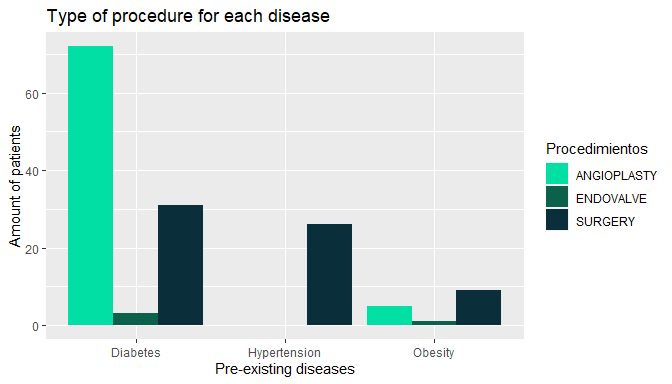

# Introduction 
El servicio de cardiología del Hospital Austral nos ha proporcionado una tabla que cuenta con 345 pacientes con algún problema coronario. Para desarrollar un análisis y una predicción acorde a las exigencias que nos encomendaron a cumplir, en primer lugar, tuvimos que buscar papers y artículos desarrollados por especialistas en cardiología para ponernos en sintonía con el lenguaje de la tabla. Una vez familiarizado con el dataset, comenzamos con el análisis y desarrollo queries con el fin de vincular datos dentro del dataset y explicitar dicha información en gráficos.  (Falta lo de predictor)

The cardiologic service of Austral Hospital has given us a dataset that counts with 345 patients that suffer from some kind of coronary dysfunction.  In order to develop an accurate analysis and prediction according to the requirements entrusted to fulfill, we started searching papers and articles written by specialists on the subject so that we could get in sintony with the language used in the dataset. Once we acquired a certain level of knowledge, we lead off with the analysis and development of queries with the purpose of creating links between the different types of data inside the dataset, and portray this information on graphs.

## Data Analysis
En esta sección del reporte, se van a mostrar las queries diseñadas y el análisis de las mismas haciendo especial énfasis  los impactos de los diferentes factores en los problemas coronarios

In this section of the report, it is going to be shown the queries designed and the analysis making special focus on the impact of most of the factors concerning coronary issues.

### Gender 
De acuerdo al National Heart, Lung and Blood Institute, en los hombres, el riesgo de padecer algún tipo de enfermedad coronaria aumenta a partir de los 45 años mientras que en las mujeres el riesgo empieza a aparecer por arriba de los 55 años, ya que producen menos estrógeno, una hormona que se encarga de regular la función vascular. Además, a medida que uno envejece, las arterias y las venas se van achicando, elevando el riesgo de padecer alguna complicación cardíaca. Como se puede ver en los gráficos, el principal motivo de ingreso tanto hombres mayores a 45 años como en mujeres mayores a 55 es PROG CORONARIO (206 pacientes hombres y 27 pacientes mujeres). 

According to the National Heart, Lung and Blood Institute, the risk of suffering some kind of coronary complication in men starts to increase at the age of 45, while in women this trend appears at the age of 55. This is because, after the menopause, womens production of estrogen, a hormone that modulates the vascular function, decreases considerably. Besides, as people get older, the arteries and vessels become narrower. As it can be seen in the graphs, the most common reason of admission in both, men over the age of 45 and women  over the age of 55, is PROG CORONARIO (206 male patients and 27 female patients)
/n


```{=html}
<div id="htmlwidget-83897529751d925a8b29" style="width:672px;height:384px;" class="plotly html-widget"></div>
<script type="application/json" data-for="htmlwidget-83897529751d925a8b29">{"x":{"visdat":{"1dcc3116da2":["function () ","plotlyVisDat"],"1dcc30e81e81":["function () ","data"]},"cur_data":"1dcc30e81e81","attrs":{"1dcc30e81e81":{"color":["SCA no SST","PROG VALV","SCA no SST","PROG VALV","PROG CORONARIO","PROG CORONARIO","PROG CORONARIO","PROG CORONARIO","PROG CORONARIO","PROG CORONARIO","PROG VALV","PROG VALV","PROG VALV","PROG CORONARIO","PROG CORONARIO","PROG CORONARIO","PROG CORONARIO","PROG CORONARIO","PROG CORONARIO","PROG CORONARIO","PROG CORONARIO","PROG CORONARIO","PROG CORONARIO","PROG CORONARIO","OTRA","PROG CORONARIO","PROG VALV","PROG CORONARIO","PROG CORONARIO","PROG CORONARIO","PROG CORONARIO","MIXOMA Y OTROS TUMORES","PROG VALV","HTPULMONAR","PROG VALV","PROG CORONARIO","PROG VALV","PROG VALV","ANEURISMA AO","PROG VALV","PROG CORONARIO","PROG CORONARIO","PROG CORONARIO","PROG CORONARIO","PROG CORONARIO","SCA SST","PROG VALV","PROG CORONARIO","PROG CORONARIO","PROG CORONARIO","PROG CORONARIO","SINCOPE","PROG CORONARIO","PROG CORONARIO","PROG CORONARIO","PROG CORONARIO","PROG CORONARIO","PROG VALV","PROG VALV","PROG CORONARIO","PROG CORONARIO","INSUFICIENCIA CARDIACA","PROG CORONARIO","PROG CORONARIO","PROG VALV","PROG VALV","PROG CORONARIO","PROG VALV","PROG CORONARIO","PROG CORONARIO","INSUFICIENCIA CARDIACA","PROG CORONARIO","PROG CORONARIO","PROG CORONARIO","PROG CORONARIO","PROG CORONARIO","PROG CORONARIO","PROG CORONARIO","PROG CORONARIO","PROG VALV","PROG CORONARIO","PROG CORONARIO","PROG CORONARIO","PROG VALV","OTRA","ANEURISMA AO","PROG CORONARIO","PROG CORONARIO","OTRA","PROG CORONARIO","PROG CORONARIO","PROG CORONARIO","PROG CORONARIO","PROG CORONARIO","PROG CORONARIO","PROG CORONARIO","PROG CORONARIO","PROG CORONARIO","PROG CORONARIO","PROG CORONARIO","INSUFICIENCIA CARDIACA","PROG CORONARIO","PROG CORONARIO","PROG CORONARIO","PROG CORONARIO","PROG CORONARIO","PROG CORONARIO","PROG CORONARIO","PROG CORONARIO","PROG CORONARIO","PROG CORONARIO","PROG CORONARIO","PROG CORONARIO","PROG CORONARIO","PROG CORONARIO","PROG CORONARIO","PROG CORONARIO","PROG CORONARIO","PROG CORONARIO","PROG CORONARIO","PROG CORONARIO","PROG CORONARIO","PROG CORONARIO","INSUFICIENCIA CARDIACA","PROG CORONARIO","PROG CORONARIO","PROG CORONARIO","PROG CORONARIO","PROG CORONARIO","PROG CORONARIO","PROG CORONARIO","INSUFICIENCIA CARDIACA","PROG CORONARIO","PROG VALV","PROG CORONARIO","PROG CORONARIO","INSUFICIENCIA CARDIACA","PROG CORONARIO","PROGRAMADO TAVI","PROG CORONARIO","PROG VALV","PROG CORONARIO","PROG CORONARIO","PROG CORONARIO","PROG CORONARIO","PROG CORONARIO","PROG CORONARIO","PROG VALV","PROG CORONARIO","PROG CORONARIO","PROG VALV","PROG VALV","PROG CORONARIO","PROG CORONARIO","PROG VALV","PROG VALV","ANEURISMA AO","PROG VALV","PROG CORONARIO","PROG VALV","PROG CORONARIO","PROG CORONARIO","PROG CORONARIO","PROG CORONARIO","PROG CORONARIO","PROG VALV","PROG CORONARIO","PROG CORONARIO","PROG CORONARIO","PROG VALV","PROG VALV","PROG CORONARIO","PROG VALV","PROG CORONARIO","PROG CORONARIO","PROG CORONARIO","PROG CORONARIO","PROG CORONARIO","PROG VALV","PROG VALV","PROG VALV","PROG VALV","PROG CORONARIO","PROG CORONARIO","PROG CORONARIO","PROG CORONARIO","PROG VALV","ANEURISMA AO","PROG VALV","PROG CORONARIO","PROG CORONARIO","PROG CORONARIO","OTRA","PROG CORONARIO","SCA no SST","PROG CORONARIO","SINCOPE","PROG CORONARIO","PROG CORONARIO","PROG CORONARIO","PROG CORONARIO","PROG CORONARIO","PROG CORONARIO","PROG VALV","PROG VALV","PROG CORONARIO","PROG CORONARIO","SCA no SST","PROG CORONARIO","PROG CORONARIO","PROG CORONARIO","PROG CORONARIO","PROG CORONARIO","PROG CORONARIO","PROG CORONARIO","PROG CORONARIO","PROG CORONARIO","PROG VALV","PROG CORONARIO","PROG CORONARIO","PROG CORONARIO","PROG VALV","PROG VALV","SCA no SST","PROGRAMADO TAVI","PROG VALV","PROG CORONARIO","PROG VALV","ANEURISMA AO","SCA no SST","SCA no SST","PROG CORONARIO","PROG CORONARIO","PROG CORONARIO","PROG CORONARIO","PROG CORONARIO","PROG CORONARIO","PROG CORONARIO","PROG CORONARIO","PROG CORONARIO","PROG VALV","PROG CORONARIO","PROG CORONARIO","PROG CORONARIO","PROG CORONARIO","PROG CORONARIO","PROG CORONARIO","PROG VALV","PROG CORONARIO","ANEURISMA AO","PROG CORONARIO","PROG CORONARIO","PROG CORONARIO","PROG CORONARIO","PROG CORONARIO","PROG CORONARIO","PROG CORONARIO","PROG CORONARIO","PROG CORONARIO","PROG CORONARIO","PROG CORONARIO","PROGRAMADO TAVI","PROG CORONARIO","PROG CORONARIO","PROG CORONARIO","PROG CORONARIO","PROG CORONARIO","PROG CORONARIO","PROG CORONARIO","PROG CORONARIO","PROG VALV","PROG CORONARIO","PROG CORONARIO","PROG CORONARIO","PROG CORONARIO","PROG CORONARIO","PROG VALV","PROG CORONARIO","PROG CORONARIO","PROG CORONARIO","PROG CORONARIO","PROG VALV","PROG CORONARIO","PROG CORONARIO","PROG CORONARIO","PROG CORONARIO","PROG CORONARIO","PROG VALV","SCA no SST"],"colors":["#58FAD0","#01DF74","#088A68","#01DFA5","#0B614B","#0B2F3A","#086A87","#01A9DB","#2ECCFA","#A9BCF5","#0080FF"],"alpha":1,"alpha_stroke":1,"sizes":[10,100],"spans":[1,20],"x":["SCA no SST","PROG VALV","SCA no SST","PROG VALV","PROG CORONARIO","PROG CORONARIO","PROG CORONARIO","PROG CORONARIO","PROG CORONARIO","PROG CORONARIO","PROG VALV","PROG VALV","PROG VALV","PROG CORONARIO","PROG CORONARIO","PROG CORONARIO","PROG CORONARIO","PROG CORONARIO","PROG CORONARIO","PROG CORONARIO","PROG CORONARIO","PROG CORONARIO","PROG CORONARIO","PROG CORONARIO","OTRA","PROG CORONARIO","PROG VALV","PROG CORONARIO","PROG CORONARIO","PROG CORONARIO","PROG CORONARIO","MIXOMA Y OTROS TUMORES","PROG VALV","HTPULMONAR","PROG VALV","PROG CORONARIO","PROG VALV","PROG VALV","ANEURISMA AO","PROG VALV","PROG CORONARIO","PROG CORONARIO","PROG CORONARIO","PROG CORONARIO","PROG CORONARIO","SCA SST","PROG VALV","PROG CORONARIO","PROG CORONARIO","PROG CORONARIO","PROG CORONARIO","SINCOPE","PROG CORONARIO","PROG CORONARIO","PROG CORONARIO","PROG CORONARIO","PROG CORONARIO","PROG VALV","PROG VALV","PROG CORONARIO","PROG CORONARIO","INSUFICIENCIA CARDIACA","PROG CORONARIO","PROG CORONARIO","PROG VALV","PROG VALV","PROG CORONARIO","PROG VALV","PROG CORONARIO","PROG CORONARIO","INSUFICIENCIA CARDIACA","PROG CORONARIO","PROG CORONARIO","PROG CORONARIO","PROG CORONARIO","PROG CORONARIO","PROG CORONARIO","PROG CORONARIO","PROG CORONARIO","PROG VALV","PROG CORONARIO","PROG CORONARIO","PROG CORONARIO","PROG VALV","OTRA","ANEURISMA AO","PROG CORONARIO","PROG CORONARIO","OTRA","PROG CORONARIO","PROG CORONARIO","PROG CORONARIO","PROG CORONARIO","PROG CORONARIO","PROG CORONARIO","PROG CORONARIO","PROG CORONARIO","PROG CORONARIO","PROG CORONARIO","PROG CORONARIO","INSUFICIENCIA CARDIACA","PROG CORONARIO","PROG CORONARIO","PROG CORONARIO","PROG CORONARIO","PROG CORONARIO","PROG CORONARIO","PROG CORONARIO","PROG CORONARIO","PROG CORONARIO","PROG CORONARIO","PROG CORONARIO","PROG CORONARIO","PROG CORONARIO","PROG CORONARIO","PROG CORONARIO","PROG CORONARIO","PROG CORONARIO","PROG CORONARIO","PROG CORONARIO","PROG CORONARIO","PROG CORONARIO","PROG CORONARIO","INSUFICIENCIA CARDIACA","PROG CORONARIO","PROG CORONARIO","PROG CORONARIO","PROG CORONARIO","PROG CORONARIO","PROG CORONARIO","PROG CORONARIO","INSUFICIENCIA CARDIACA","PROG CORONARIO","PROG VALV","PROG CORONARIO","PROG CORONARIO","INSUFICIENCIA CARDIACA","PROG CORONARIO","PROGRAMADO TAVI","PROG CORONARIO","PROG VALV","PROG CORONARIO","PROG CORONARIO","PROG CORONARIO","PROG CORONARIO","PROG CORONARIO","PROG CORONARIO","PROG VALV","PROG CORONARIO","PROG CORONARIO","PROG VALV","PROG VALV","PROG CORONARIO","PROG CORONARIO","PROG VALV","PROG VALV","ANEURISMA AO","PROG VALV","PROG CORONARIO","PROG VALV","PROG CORONARIO","PROG CORONARIO","PROG CORONARIO","PROG CORONARIO","PROG CORONARIO","PROG VALV","PROG CORONARIO","PROG CORONARIO","PROG CORONARIO","PROG VALV","PROG VALV","PROG CORONARIO","PROG VALV","PROG CORONARIO","PROG CORONARIO","PROG CORONARIO","PROG CORONARIO","PROG CORONARIO","PROG VALV","PROG VALV","PROG VALV","PROG VALV","PROG CORONARIO","PROG CORONARIO","PROG CORONARIO","PROG CORONARIO","PROG VALV","ANEURISMA AO","PROG VALV","PROG CORONARIO","PROG CORONARIO","PROG CORONARIO","OTRA","PROG CORONARIO","SCA no SST","PROG CORONARIO","SINCOPE","PROG CORONARIO","PROG CORONARIO","PROG CORONARIO","PROG CORONARIO","PROG CORONARIO","PROG CORONARIO","PROG VALV","PROG VALV","PROG CORONARIO","PROG CORONARIO","SCA no SST","PROG CORONARIO","PROG CORONARIO","PROG CORONARIO","PROG CORONARIO","PROG CORONARIO","PROG CORONARIO","PROG CORONARIO","PROG CORONARIO","PROG CORONARIO","PROG VALV","PROG CORONARIO","PROG CORONARIO","PROG CORONARIO","PROG VALV","PROG VALV","SCA no SST","PROGRAMADO TAVI","PROG VALV","PROG CORONARIO","PROG VALV","ANEURISMA AO","SCA no SST","SCA no SST","PROG CORONARIO","PROG CORONARIO","PROG CORONARIO","PROG CORONARIO","PROG CORONARIO","PROG CORONARIO","PROG CORONARIO","PROG CORONARIO","PROG CORONARIO","PROG VALV","PROG CORONARIO","PROG CORONARIO","PROG CORONARIO","PROG CORONARIO","PROG CORONARIO","PROG CORONARIO","PROG VALV","PROG CORONARIO","ANEURISMA AO","PROG CORONARIO","PROG CORONARIO","PROG CORONARIO","PROG CORONARIO","PROG CORONARIO","PROG CORONARIO","PROG CORONARIO","PROG CORONARIO","PROG CORONARIO","PROG CORONARIO","PROG CORONARIO","PROGRAMADO TAVI","PROG CORONARIO","PROG CORONARIO","PROG CORONARIO","PROG CORONARIO","PROG CORONARIO","PROG CORONARIO","PROG CORONARIO","PROG CORONARIO","PROG VALV","PROG CORONARIO","PROG CORONARIO","PROG CORONARIO","PROG CORONARIO","PROG CORONARIO","PROG VALV","PROG CORONARIO","PROG CORONARIO","PROG CORONARIO","PROG CORONARIO","PROG VALV","PROG CORONARIO","PROG CORONARIO","PROG CORONARIO","PROG CORONARIO","PROG CORONARIO","PROG VALV","SCA no SST"],"type":"histogram","inherit":true}},"layout":{"margin":{"b":40,"l":60,"t":25,"r":10},"barmode":"overlay","showlegend":false,"title":"Reasons for admission for men over 45 years of age","xaxis":{"domain":[0,1],"automargin":true,"title":"Reasons for admission","type":"category","categoryorder":"array","categoryarray":["ANEURISMA AO","HTPULMONAR","INSUFICIENCIA CARDIACA","MIXOMA Y OTROS TUMORES","OTRA","PROG CORONARIO","PROG VALV","PROGRAMADO TAVI","SCA no SST","SCA SST","SINCOPE"]},"yaxis":{"domain":[0,1],"automargin":true,"title":"Amount of people"},"hovermode":"closest"},"source":"A","config":{"showSendToCloud":false},"data":[{"x":["ANEURISMA AO","ANEURISMA AO","ANEURISMA AO","ANEURISMA AO","ANEURISMA AO","ANEURISMA AO"],"type":"histogram","name":"ANEURISMA AO","marker":{"color":"rgba(88,250,208,1)","line":{"color":"rgba(88,250,208,1)"}},"error_y":{"color":"rgba(88,250,208,1)"},"error_x":{"color":"rgba(88,250,208,1)"},"xaxis":"x","yaxis":"y","frame":null},{"x":["HTPULMONAR"],"type":"histogram","name":"HTPULMONAR","marker":{"color":"rgba(1,223,116,1)","line":{"color":"rgba(1,223,116,1)"}},"error_y":{"color":"rgba(1,223,116,1)"},"error_x":{"color":"rgba(1,223,116,1)"},"xaxis":"x","yaxis":"y","frame":null},{"x":["INSUFICIENCIA CARDIACA","INSUFICIENCIA CARDIACA","INSUFICIENCIA CARDIACA","INSUFICIENCIA CARDIACA","INSUFICIENCIA CARDIACA","INSUFICIENCIA CARDIACA"],"type":"histogram","name":"INSUFICIENCIA CARDIACA","marker":{"color":"rgba(8,138,104,1)","line":{"color":"rgba(8,138,104,1)"}},"error_y":{"color":"rgba(8,138,104,1)"},"error_x":{"color":"rgba(8,138,104,1)"},"xaxis":"x","yaxis":"y","frame":null},{"x":["MIXOMA Y OTROS TUMORES"],"type":"histogram","name":"MIXOMA Y OTROS TUMORES","marker":{"color":"rgba(1,223,165,1)","line":{"color":"rgba(1,223,165,1)"}},"error_y":{"color":"rgba(1,223,165,1)"},"error_x":{"color":"rgba(1,223,165,1)"},"xaxis":"x","yaxis":"y","frame":null},{"x":["OTRA","OTRA","OTRA","OTRA"],"type":"histogram","name":"OTRA","marker":{"color":"rgba(11,97,75,1)","line":{"color":"rgba(11,97,75,1)"}},"error_y":{"color":"rgba(11,97,75,1)"},"error_x":{"color":"rgba(11,97,75,1)"},"xaxis":"x","yaxis":"y","frame":null},{"x":["PROG CORONARIO","PROG CORONARIO","PROG CORONARIO","PROG CORONARIO","PROG CORONARIO","PROG CORONARIO","PROG CORONARIO","PROG CORONARIO","PROG CORONARIO","PROG CORONARIO","PROG CORONARIO","PROG CORONARIO","PROG CORONARIO","PROG CORONARIO","PROG CORONARIO","PROG CORONARIO","PROG CORONARIO","PROG CORONARIO","PROG CORONARIO","PROG CORONARIO","PROG CORONARIO","PROG CORONARIO","PROG CORONARIO","PROG CORONARIO","PROG CORONARIO","PROG CORONARIO","PROG CORONARIO","PROG CORONARIO","PROG CORONARIO","PROG CORONARIO","PROG CORONARIO","PROG CORONARIO","PROG CORONARIO","PROG CORONARIO","PROG CORONARIO","PROG CORONARIO","PROG CORONARIO","PROG CORONARIO","PROG CORONARIO","PROG CORONARIO","PROG CORONARIO","PROG CORONARIO","PROG CORONARIO","PROG CORONARIO","PROG CORONARIO","PROG CORONARIO","PROG CORONARIO","PROG CORONARIO","PROG CORONARIO","PROG CORONARIO","PROG CORONARIO","PROG CORONARIO","PROG CORONARIO","PROG CORONARIO","PROG CORONARIO","PROG CORONARIO","PROG CORONARIO","PROG CORONARIO","PROG CORONARIO","PROG CORONARIO","PROG CORONARIO","PROG CORONARIO","PROG CORONARIO","PROG CORONARIO","PROG CORONARIO","PROG CORONARIO","PROG CORONARIO","PROG CORONARIO","PROG CORONARIO","PROG CORONARIO","PROG CORONARIO","PROG CORONARIO","PROG CORONARIO","PROG CORONARIO","PROG CORONARIO","PROG CORONARIO","PROG CORONARIO","PROG CORONARIO","PROG CORONARIO","PROG CORONARIO","PROG CORONARIO","PROG CORONARIO","PROG CORONARIO","PROG CORONARIO","PROG CORONARIO","PROG CORONARIO","PROG CORONARIO","PROG CORONARIO","PROG CORONARIO","PROG CORONARIO","PROG CORONARIO","PROG CORONARIO","PROG CORONARIO","PROG CORONARIO","PROG CORONARIO","PROG CORONARIO","PROG CORONARIO","PROG CORONARIO","PROG CORONARIO","PROG CORONARIO","PROG CORONARIO","PROG CORONARIO","PROG CORONARIO","PROG CORONARIO","PROG CORONARIO","PROG CORONARIO","PROG CORONARIO","PROG CORONARIO","PROG CORONARIO","PROG CORONARIO","PROG CORONARIO","PROG CORONARIO","PROG CORONARIO","PROG CORONARIO","PROG CORONARIO","PROG CORONARIO","PROG CORONARIO","PROG CORONARIO","PROG CORONARIO","PROG CORONARIO","PROG CORONARIO","PROG CORONARIO","PROG CORONARIO","PROG CORONARIO","PROG CORONARIO","PROG CORONARIO","PROG CORONARIO","PROG CORONARIO","PROG CORONARIO","PROG CORONARIO","PROG CORONARIO","PROG CORONARIO","PROG CORONARIO","PROG CORONARIO","PROG CORONARIO","PROG CORONARIO","PROG CORONARIO","PROG CORONARIO","PROG CORONARIO","PROG CORONARIO","PROG CORONARIO","PROG CORONARIO","PROG CORONARIO","PROG CORONARIO","PROG CORONARIO","PROG CORONARIO","PROG CORONARIO","PROG CORONARIO","PROG CORONARIO","PROG CORONARIO","PROG CORONARIO","PROG CORONARIO","PROG CORONARIO","PROG CORONARIO","PROG CORONARIO","PROG CORONARIO","PROG CORONARIO","PROG CORONARIO","PROG CORONARIO","PROG CORONARIO","PROG CORONARIO","PROG CORONARIO","PROG CORONARIO","PROG CORONARIO","PROG CORONARIO","PROG CORONARIO","PROG CORONARIO","PROG CORONARIO","PROG CORONARIO","PROG CORONARIO","PROG CORONARIO","PROG CORONARIO","PROG CORONARIO","PROG CORONARIO","PROG CORONARIO","PROG CORONARIO","PROG CORONARIO","PROG CORONARIO","PROG CORONARIO","PROG CORONARIO","PROG CORONARIO","PROG CORONARIO","PROG CORONARIO","PROG CORONARIO","PROG CORONARIO","PROG CORONARIO","PROG CORONARIO","PROG CORONARIO","PROG CORONARIO","PROG CORONARIO","PROG CORONARIO","PROG CORONARIO","PROG CORONARIO","PROG CORONARIO","PROG CORONARIO","PROG CORONARIO","PROG CORONARIO","PROG CORONARIO","PROG CORONARIO","PROG CORONARIO","PROG CORONARIO","PROG CORONARIO","PROG CORONARIO","PROG CORONARIO","PROG CORONARIO","PROG CORONARIO"],"type":"histogram","name":"PROG CORONARIO","marker":{"color":"rgba(11,47,58,1)","line":{"color":"rgba(11,47,58,1)"}},"error_y":{"color":"rgba(11,47,58,1)"},"error_x":{"color":"rgba(11,47,58,1)"},"xaxis":"x","yaxis":"y","frame":null},{"x":["PROG VALV","PROG VALV","PROG VALV","PROG VALV","PROG VALV","PROG VALV","PROG VALV","PROG VALV","PROG VALV","PROG VALV","PROG VALV","PROG VALV","PROG VALV","PROG VALV","PROG VALV","PROG VALV","PROG VALV","PROG VALV","PROG VALV","PROG VALV","PROG VALV","PROG VALV","PROG VALV","PROG VALV","PROG VALV","PROG VALV","PROG VALV","PROG VALV","PROG VALV","PROG VALV","PROG VALV","PROG VALV","PROG VALV","PROG VALV","PROG VALV","PROG VALV","PROG VALV","PROG VALV","PROG VALV","PROG VALV","PROG VALV","PROG VALV","PROG VALV","PROG VALV","PROG VALV","PROG VALV","PROG VALV","PROG VALV","PROG VALV","PROG VALV","PROG VALV"],"type":"histogram","name":"PROG VALV","marker":{"color":"rgba(8,106,135,1)","line":{"color":"rgba(8,106,135,1)"}},"error_y":{"color":"rgba(8,106,135,1)"},"error_x":{"color":"rgba(8,106,135,1)"},"xaxis":"x","yaxis":"y","frame":null},{"x":["PROGRAMADO TAVI","PROGRAMADO TAVI","PROGRAMADO TAVI"],"type":"histogram","name":"PROGRAMADO TAVI","marker":{"color":"rgba(1,169,219,1)","line":{"color":"rgba(1,169,219,1)"}},"error_y":{"color":"rgba(1,169,219,1)"},"error_x":{"color":"rgba(1,169,219,1)"},"xaxis":"x","yaxis":"y","frame":null},{"x":["SCA no SST","SCA no SST","SCA no SST","SCA no SST","SCA no SST","SCA no SST","SCA no SST","SCA no SST"],"type":"histogram","name":"SCA no SST","marker":{"color":"rgba(46,204,250,1)","line":{"color":"rgba(46,204,250,1)"}},"error_y":{"color":"rgba(46,204,250,1)"},"error_x":{"color":"rgba(46,204,250,1)"},"xaxis":"x","yaxis":"y","frame":null},{"x":["SCA SST"],"type":"histogram","name":"SCA SST","marker":{"color":"rgba(169,188,245,1)","line":{"color":"rgba(169,188,245,1)"}},"error_y":{"color":"rgba(169,188,245,1)"},"error_x":{"color":"rgba(169,188,245,1)"},"xaxis":"x","yaxis":"y","frame":null},{"x":["SINCOPE","SINCOPE"],"type":"histogram","name":"SINCOPE","marker":{"color":"rgba(0,128,255,1)","line":{"color":"rgba(0,128,255,1)"}},"error_y":{"color":"rgba(0,128,255,1)"},"error_x":{"color":"rgba(0,128,255,1)"},"xaxis":"x","yaxis":"y","frame":null}],"highlight":{"on":"plotly_click","persistent":false,"dynamic":false,"selectize":false,"opacityDim":0.2,"selected":{"opacity":1},"debounce":0},"shinyEvents":["plotly_hover","plotly_click","plotly_selected","plotly_relayout","plotly_brushed","plotly_brushing","plotly_clickannotation","plotly_doubleclick","plotly_deselect","plotly_afterplot","plotly_sunburstclick"],"base_url":"https://plot.ly"},"evals":[],"jsHooks":[]}</script>
```

```{=html}
<div id="htmlwidget-4961bd794fb0c19bfe2d" style="width:672px;height:384px;" class="plotly html-widget"></div>
<script type="application/json" data-for="htmlwidget-4961bd794fb0c19bfe2d">{"x":{"visdat":{"1dcc4a023ba":["function () ","plotlyVisDat"],"1dcc18d84f8d":["function () ","data"]},"cur_data":"1dcc18d84f8d","attrs":{"1dcc18d84f8d":{"color":["PROG CORONARIO","PROG VALV","ANEURISMA AO","PROG VALV","PROG VALV","PROG VALV","PROG CORONARIO","PROG VALV","PROG VALV","PROG CORONARIO","PROG CORONARIO","SCA no SST","SCA no SST","PROG VALV","PROG VALV","PROGRAMADO TAVI","PROG CORONARIO","PROG VALV","PROG VALV","PROG CORONARIO","PROG CORONARIO","OTRA","PROG VALV","PROG VALV","PROG CORONARIO","PROG CORONARIO","PROG VALV","PROG CORONARIO","PROG CORONARIO","PROG CORONARIO","PROG CORONARIO","PROG CORONARIO","PROG CORONARIO","PROG CORONARIO","PROGRAMADO TAVI","PROG CORONARIO","PROG VALV","PROG CORONARIO","PROG VALV","PROG CORONARIO","PROG CORONARIO","PROG CORONARIO","HTPULMONAR","PROG CORONARIO","PROG CORONARIO","PROG CORONARIO","PROG VALV","PROG VALV","PROG CORONARIO","PROG CORONARIO","PROG VALV","PROG VALV","PROG VALV","PROG CORONARIO","PROG VALV","PROG VALV"],"colors":["#01DFA5","#0B614B","#0B2F3A","#086A87","#01A9DB","#2ECCFA","#A9BCF5"],"alpha":1,"alpha_stroke":1,"sizes":[10,100],"spans":[1,20],"x":["PROG CORONARIO","PROG VALV","ANEURISMA AO","PROG VALV","PROG VALV","PROG VALV","PROG CORONARIO","PROG VALV","PROG VALV","PROG CORONARIO","PROG CORONARIO","SCA no SST","SCA no SST","PROG VALV","PROG VALV","PROGRAMADO TAVI","PROG CORONARIO","PROG VALV","PROG VALV","PROG CORONARIO","PROG CORONARIO","OTRA","PROG VALV","PROG VALV","PROG CORONARIO","PROG CORONARIO","PROG VALV","PROG CORONARIO","PROG CORONARIO","PROG CORONARIO","PROG CORONARIO","PROG CORONARIO","PROG CORONARIO","PROG CORONARIO","PROGRAMADO TAVI","PROG CORONARIO","PROG VALV","PROG CORONARIO","PROG VALV","PROG CORONARIO","PROG CORONARIO","PROG CORONARIO","HTPULMONAR","PROG CORONARIO","PROG CORONARIO","PROG CORONARIO","PROG VALV","PROG VALV","PROG CORONARIO","PROG CORONARIO","PROG VALV","PROG VALV","PROG VALV","PROG CORONARIO","PROG VALV","PROG VALV"],"type":"histogram","inherit":true}},"layout":{"margin":{"b":40,"l":60,"t":25,"r":10},"barmode":"overlay","showlegend":false,"title":"Reasons for admission for women over 55 years of age","xaxis":{"domain":[0,1],"automargin":true,"title":"Reasons for admission","type":"category","categoryorder":"array","categoryarray":["ANEURISMA AO","HTPULMONAR","OTRA","PROG CORONARIO","PROG VALV","PROGRAMADO TAVI","SCA no SST"]},"yaxis":{"domain":[0,1],"automargin":true,"title":"Amount of people"},"hovermode":"closest"},"source":"A","config":{"showSendToCloud":false},"data":[{"x":["ANEURISMA AO"],"type":"histogram","name":"ANEURISMA AO","marker":{"color":"rgba(1,223,165,1)","line":{"color":"rgba(1,223,165,1)"}},"error_y":{"color":"rgba(1,223,165,1)"},"error_x":{"color":"rgba(1,223,165,1)"},"xaxis":"x","yaxis":"y","frame":null},{"x":["HTPULMONAR"],"type":"histogram","name":"HTPULMONAR","marker":{"color":"rgba(11,97,75,1)","line":{"color":"rgba(11,97,75,1)"}},"error_y":{"color":"rgba(11,97,75,1)"},"error_x":{"color":"rgba(11,97,75,1)"},"xaxis":"x","yaxis":"y","frame":null},{"x":["OTRA"],"type":"histogram","name":"OTRA","marker":{"color":"rgba(11,47,58,1)","line":{"color":"rgba(11,47,58,1)"}},"error_y":{"color":"rgba(11,47,58,1)"},"error_x":{"color":"rgba(11,47,58,1)"},"xaxis":"x","yaxis":"y","frame":null},{"x":["PROG CORONARIO","PROG CORONARIO","PROG CORONARIO","PROG CORONARIO","PROG CORONARIO","PROG CORONARIO","PROG CORONARIO","PROG CORONARIO","PROG CORONARIO","PROG CORONARIO","PROG CORONARIO","PROG CORONARIO","PROG CORONARIO","PROG CORONARIO","PROG CORONARIO","PROG CORONARIO","PROG CORONARIO","PROG CORONARIO","PROG CORONARIO","PROG CORONARIO","PROG CORONARIO","PROG CORONARIO","PROG CORONARIO","PROG CORONARIO","PROG CORONARIO","PROG CORONARIO","PROG CORONARIO"],"type":"histogram","name":"PROG CORONARIO","marker":{"color":"rgba(8,106,135,1)","line":{"color":"rgba(8,106,135,1)"}},"error_y":{"color":"rgba(8,106,135,1)"},"error_x":{"color":"rgba(8,106,135,1)"},"xaxis":"x","yaxis":"y","frame":null},{"x":["PROG VALV","PROG VALV","PROG VALV","PROG VALV","PROG VALV","PROG VALV","PROG VALV","PROG VALV","PROG VALV","PROG VALV","PROG VALV","PROG VALV","PROG VALV","PROG VALV","PROG VALV","PROG VALV","PROG VALV","PROG VALV","PROG VALV","PROG VALV","PROG VALV","PROG VALV"],"type":"histogram","name":"PROG VALV","marker":{"color":"rgba(1,169,219,1)","line":{"color":"rgba(1,169,219,1)"}},"error_y":{"color":"rgba(1,169,219,1)"},"error_x":{"color":"rgba(1,169,219,1)"},"xaxis":"x","yaxis":"y","frame":null},{"x":["PROGRAMADO TAVI","PROGRAMADO TAVI"],"type":"histogram","name":"PROGRAMADO TAVI","marker":{"color":"rgba(46,204,250,1)","line":{"color":"rgba(46,204,250,1)"}},"error_y":{"color":"rgba(46,204,250,1)"},"error_x":{"color":"rgba(46,204,250,1)"},"xaxis":"x","yaxis":"y","frame":null},{"x":["SCA no SST","SCA no SST"],"type":"histogram","name":"SCA no SST","marker":{"color":"rgba(169,188,245,1)","line":{"color":"rgba(169,188,245,1)"}},"error_y":{"color":"rgba(169,188,245,1)"},"error_x":{"color":"rgba(169,188,245,1)"},"xaxis":"x","yaxis":"y","frame":null}],"highlight":{"on":"plotly_click","persistent":false,"dynamic":false,"selectize":false,"opacityDim":0.2,"selected":{"opacity":1},"debounce":0},"shinyEvents":["plotly_hover","plotly_click","plotly_selected","plotly_relayout","plotly_brushed","plotly_brushing","plotly_clickannotation","plotly_doubleclick","plotly_deselect","plotly_afterplot","plotly_sunburstclick"],"base_url":"https://plot.ly"},"evals":[],"jsHooks":[]}</script>
```

###FEY
La FEY es una medida expresada en porcentaje  de la cantidad de sangre que bombea el ventrículo izquierdo con cada contracción. La American Heart Association informa que para que el fey esté en una media correcta, debe tener unos índices de entre 50 y 70. Se considera baja cuando se encuentra entre 40 y 50,  y si supera los 70 significa que  la persona padecerá miocardiopatía hipertrófica.
Gracias al gráfico obtenido podemos concluir que la media de fey de los pacientes analizados, se mantuvo en un  nivel correcto, dando como resultado 57.14.

The FEY is a measurement expressed as a percentage of the amount of blood pushed out by the left ventricle with every heartbeat. The American Heart Association informs that a normal level of FEY is between 50 and 70. If the person has a fey under 50 and above 40 it's on the borderline, which does not necessarily mean that the person is suffering from a heart dysfunction. However, the critical values are found under 40 (that is considered too low and a potential patient with cardiomyopathy) and over 70 (very high level, possibly the person suffers hypertrophic cardiomyopathy).  Under the data given in the dataset, it can be seen that the mean of FEY equals to 57.14, which means that most of the patients included in the dataset have a normal level


<!-- -->

### Previous intervention with complications 

Researchers from the Instituto de Cardiología y Cirugía Cardiovascular de La Habana (Cuba) did a study on 1264 patients from which a 21% of them presented a coronary preoperative intervention. Given the results, they concluded that this is one of the main risk factors that lead to postoperative and transoperative complications. Based on this, we decided to analyze the amount of  patients that had some kind of complication according to their previous clinical intervention. It resulted in 16 patients presenting complications: 4 were intervened by angioplasty previously, 1 by CRM   and 11 by valvular.


```{=html}
<div id="htmlwidget-347f7a487a6d812bbb5f" style="width:672px;height:384px;" class="plotly html-widget"></div>
<script type="application/json" data-for="htmlwidget-347f7a487a6d812bbb5f">{"x":{"visdat":{"1dcc685028f3":["function () ","plotlyVisDat"],"1dcc13ce78f2":["function () ","data"]},"cur_data":"1dcc13ce78f2","attrs":{"1dcc13ce78f2":{"texts":["a","b","c"],"hoverinfo":"texts","color":["VALVULAR","VALVULAR","VALVULAR","VALVULAR","ANGIOPLASTIA","ANGIOPLASTIA","VALVULAR","ANGIOPLASTIA","VALVULAR","ANGIOPLASTIA","VALVULAR","VALVULAR","VALVULAR","VALVULAR","CRM","VALVULAR"],"colors":["#01DFA5","#0B614B","#0B2F3A"],"alpha":1,"alpha_stroke":1,"sizes":[10,100],"spans":[1,20],"x":["VALVULAR","VALVULAR","VALVULAR","VALVULAR","ANGIOPLASTIA","ANGIOPLASTIA","VALVULAR","ANGIOPLASTIA","VALVULAR","ANGIOPLASTIA","VALVULAR","VALVULAR","VALVULAR","VALVULAR","CRM","VALVULAR"],"type":"histogram","inherit":true}},"layout":{"margin":{"b":40,"l":60,"t":25,"r":10},"barmode":"overlay","showlegend":false,"title":"Complications according to the type of previous intervention","xaxis":{"domain":[0,1],"automargin":true,"title":"Types of previous interventions","type":"category","categoryorder":"array","categoryarray":["ANGIOPLASTIA","CRM","VALVULAR"]},"yaxis":{"domain":[0,1],"automargin":true,"title":"Amount of people"},"hovermode":"closest"},"source":"A","config":{"showSendToCloud":false},"data":[{"texts":["a","b","c"],"hoverinfo":["texts","texts","texts","texts"],"x":["ANGIOPLASTIA","ANGIOPLASTIA","ANGIOPLASTIA","ANGIOPLASTIA"],"type":"histogram","name":"ANGIOPLASTIA","marker":{"color":"rgba(1,223,165,1)","line":{"color":"rgba(1,223,165,1)"}},"error_y":{"color":"rgba(1,223,165,1)"},"error_x":{"color":"rgba(1,223,165,1)"},"xaxis":"x","yaxis":"y","frame":null},{"texts":["a","b","c"],"hoverinfo":"texts","x":["CRM"],"type":"histogram","name":"CRM","marker":{"color":"rgba(11,97,75,1)","line":{"color":"rgba(11,97,75,1)"}},"error_y":{"color":"rgba(11,97,75,1)"},"error_x":{"color":"rgba(11,97,75,1)"},"xaxis":"x","yaxis":"y","frame":null},{"texts":["a","b","c"],"hoverinfo":["texts","texts","texts","texts","texts","texts","texts","texts","texts","texts","texts"],"x":["VALVULAR","VALVULAR","VALVULAR","VALVULAR","VALVULAR","VALVULAR","VALVULAR","VALVULAR","VALVULAR","VALVULAR","VALVULAR"],"type":"histogram","name":"VALVULAR","marker":{"color":"rgba(11,47,58,1)","line":{"color":"rgba(11,47,58,1)"}},"error_y":{"color":"rgba(11,47,58,1)"},"error_x":{"color":"rgba(11,47,58,1)"},"xaxis":"x","yaxis":"y","frame":null}],"highlight":{"on":"plotly_click","persistent":false,"dynamic":false,"selectize":false,"opacityDim":0.2,"selected":{"opacity":1},"debounce":0},"shinyEvents":["plotly_hover","plotly_click","plotly_selected","plotly_relayout","plotly_brushed","plotly_brushing","plotly_clickannotation","plotly_doubleclick","plotly_deselect","plotly_afterplot","plotly_sunburstclick"],"base_url":"https://plot.ly"},"evals":[],"jsHooks":[]}</script>
```

<!-- -->


Number of injuries


```{=html}
<div id="htmlwidget-723073104d21a855ca3a" style="width:100%;height:500px;" class="highchart html-widget"></div>
<script type="application/json" data-for="htmlwidget-723073104d21a855ca3a">{"x":{"hc_opts":{"chart":{"reflow":true},"title":{"text":"Amount of injuries for male patients older than 70 years old","margin":20,"align":"center","style":{"color":"#22A884","useHTML":true}},"yAxis":{"title":{"text":"y"},"type":"linear"},"credits":{"enabled":false},"exporting":{"enabled":false},"boost":{"enabled":false},"plotOptions":{"series":{"label":{"enabled":false},"turboThreshold":0,"showInLegend":false},"treemap":{"layoutAlgorithm":"squarified"},"scatter":{"marker":{"symbol":"circle"}}},"series":[{"group":"group","data":[{"y":17.02,"name":"0 injuries"},{"y":27.66,"name":"1 injuries"},{"y":27.66,"name":"2 injuries"},{"y":20.21,"name":"3 injuries"},{"y":4.26,"name":"4 injuries"},{"y":3.19,"name":"5 injuries"}],"type":"pie","name":"Percentage of patients"}],"xAxis":{"type":"category","title":{"text":"name"},"categories":null},"colors":["#01DFA5","#0B614B","#0B2F3A","#086A87","#01A9DB","#2ECCFA"]},"theme":{"colors":["#d35400","#2980b9","#2ecc71","#f1c40f","#2c3e50","#7f8c8d"],"chart":{"style":{"fontFamily":"Roboto","color":"#666666"}},"title":{"align":"left","style":{"fontFamily":"Roboto Condensed","fontWeight":"bold"}},"subtitle":{"align":"left","style":{"fontFamily":"Roboto Condensed"}},"legend":{"align":"right","verticalAlign":"bottom"},"xAxis":{"gridLineWidth":1,"gridLineColor":"#F3F3F3","lineColor":"#F3F3F3","minorGridLineColor":"#F3F3F3","tickColor":"#F3F3F3","tickWidth":1},"yAxis":{"gridLineColor":"#F3F3F3","lineColor":"#F3F3F3","minorGridLineColor":"#F3F3F3","tickColor":"#F3F3F3","tickWidth":1},"plotOptions":{"line":{"marker":{"enabled":false}},"spline":{"marker":{"enabled":false}},"area":{"marker":{"enabled":false}},"areaspline":{"marker":{"enabled":false}},"arearange":{"marker":{"enabled":false}},"bubble":{"maxSize":"10%"}},"tooltip":{"valueDecimals":2}},"conf_opts":{"global":{"Date":null,"VMLRadialGradientURL":"http =//code.highcharts.com/list(version)/gfx/vml-radial-gradient.png","canvasToolsURL":"http =//code.highcharts.com/list(version)/modules/canvas-tools.js","getTimezoneOffset":null,"timezoneOffset":0,"useUTC":true},"lang":{"contextButtonTitle":"Chart context menu","decimalPoint":".","downloadJPEG":"Download JPEG image","downloadPDF":"Download PDF document","downloadPNG":"Download PNG image","downloadSVG":"Download SVG vector image","drillUpText":"Back to {series.name}","invalidDate":null,"loading":"Loading...","months":["January","February","March","April","May","June","July","August","September","October","November","December"],"noData":"No data to display","numericSymbols":["k","M","G","T","P","E"],"printChart":"Print chart","resetZoom":"Reset zoom","resetZoomTitle":"Reset zoom level 1:1","shortMonths":["Jan","Feb","Mar","Apr","May","Jun","Jul","Aug","Sep","Oct","Nov","Dec"],"thousandsSep":" ","weekdays":["Sunday","Monday","Tuesday","Wednesday","Thursday","Friday","Saturday"]}},"type":"chart","fonts":["Roboto","Roboto+Condensed"],"debug":false},"evals":[],"jsHooks":[]}</script>
```

```{=html}
<div id="htmlwidget-5bd547ef7e94a2f50137" style="width:100%;height:500px;" class="highchart html-widget"></div>
<script type="application/json" data-for="htmlwidget-5bd547ef7e94a2f50137">{"x":{"hc_opts":{"chart":{"reflow":true},"title":{"text":"Amount of injuries for female patients older than 70 years old","margin":20,"align":"center","style":{"color":"#22A884","useHTML":true}},"yAxis":{"title":{"text":"y"},"type":"linear"},"credits":{"enabled":false},"exporting":{"enabled":false},"boost":{"enabled":false},"plotOptions":{"series":{"label":{"enabled":false},"turboThreshold":0,"showInLegend":false},"treemap":{"layoutAlgorithm":"squarified"},"scatter":{"marker":{"symbol":"circle"}}},"series":[{"group":"group","data":[{"y":47.06,"name":"0 injuries"},{"y":29.41,"name":"1 injuries"},{"y":23.53,"name":"2 injuries"}],"type":"pie","name":"Percentage of patients"}],"xAxis":{"type":"category","title":{"text":"name"},"categories":null},"colors":["#01DFA5","#0B614B","#0B2F3A"]},"theme":{"colors":["#d35400","#2980b9","#2ecc71","#f1c40f","#2c3e50","#7f8c8d"],"chart":{"style":{"fontFamily":"Roboto","color":"#666666"}},"title":{"align":"left","style":{"fontFamily":"Roboto Condensed","fontWeight":"bold"}},"subtitle":{"align":"left","style":{"fontFamily":"Roboto Condensed"}},"legend":{"align":"right","verticalAlign":"bottom"},"xAxis":{"gridLineWidth":1,"gridLineColor":"#F3F3F3","lineColor":"#F3F3F3","minorGridLineColor":"#F3F3F3","tickColor":"#F3F3F3","tickWidth":1},"yAxis":{"gridLineColor":"#F3F3F3","lineColor":"#F3F3F3","minorGridLineColor":"#F3F3F3","tickColor":"#F3F3F3","tickWidth":1},"plotOptions":{"line":{"marker":{"enabled":false}},"spline":{"marker":{"enabled":false}},"area":{"marker":{"enabled":false}},"areaspline":{"marker":{"enabled":false}},"arearange":{"marker":{"enabled":false}},"bubble":{"maxSize":"10%"}},"tooltip":{"valueDecimals":2}},"conf_opts":{"global":{"Date":null,"VMLRadialGradientURL":"http =//code.highcharts.com/list(version)/gfx/vml-radial-gradient.png","canvasToolsURL":"http =//code.highcharts.com/list(version)/modules/canvas-tools.js","getTimezoneOffset":null,"timezoneOffset":0,"useUTC":true},"lang":{"contextButtonTitle":"Chart context menu","decimalPoint":".","downloadJPEG":"Download JPEG image","downloadPDF":"Download PDF document","downloadPNG":"Download PNG image","downloadSVG":"Download SVG vector image","drillUpText":"Back to {series.name}","invalidDate":null,"loading":"Loading...","months":["January","February","March","April","May","June","July","August","September","October","November","December"],"noData":"No data to display","numericSymbols":["k","M","G","T","P","E"],"printChart":"Print chart","resetZoom":"Reset zoom","resetZoomTitle":"Reset zoom level 1:1","shortMonths":["Jan","Feb","Mar","Apr","May","Jun","Jul","Aug","Sep","Oct","Nov","Dec"],"thousandsSep":" ","weekdays":["Sunday","Monday","Tuesday","Wednesday","Thursday","Friday","Saturday"]}},"type":"chart","fonts":["Roboto","Roboto+Condensed"],"debug":false},"evals":[],"jsHooks":[]}</script>
```

```{=html}
<div id="htmlwidget-93205fc12802f29bb3bb" style="width:100%;height:500px;" class="highchart html-widget"></div>
<script type="application/json" data-for="htmlwidget-93205fc12802f29bb3bb">{"x":{"hc_opts":{"chart":{"reflow":true},"title":{"text":"Amount of injuries for male patients younger than 70 years old","margin":20,"align":"center","style":{"color":"#22A884","useHTML":true}},"yAxis":{"title":{"text":"y"},"type":"linear"},"credits":{"enabled":false},"exporting":{"enabled":false},"boost":{"enabled":false},"plotOptions":{"series":{"label":{"enabled":false},"turboThreshold":0,"showInLegend":false},"treemap":{"layoutAlgorithm":"squarified"},"scatter":{"marker":{"symbol":"circle"}}},"series":[{"group":"group","data":[{"y":25.53,"name":"0 injuries"},{"y":27.13,"name":"1 injuries"},{"y":27.66,"name":"2 injuries"},{"y":11.7,"name":"3 injuries"},{"y":6.91,"name":"4 injuries"},{"y":1.06,"name":"5 injuries"}],"type":"pie","name":"Percentage of patients"}],"xAxis":{"type":"category","title":{"text":"name"},"categories":null},"colors":["#01DFA5","#0B614B","#0B2F3A","#086A87","#01A9DB","#2ECCFA"]},"theme":{"colors":["#d35400","#2980b9","#2ecc71","#f1c40f","#2c3e50","#7f8c8d"],"chart":{"style":{"fontFamily":"Roboto","color":"#666666"}},"title":{"align":"left","style":{"fontFamily":"Roboto Condensed","fontWeight":"bold"}},"subtitle":{"align":"left","style":{"fontFamily":"Roboto Condensed"}},"legend":{"align":"right","verticalAlign":"bottom"},"xAxis":{"gridLineWidth":1,"gridLineColor":"#F3F3F3","lineColor":"#F3F3F3","minorGridLineColor":"#F3F3F3","tickColor":"#F3F3F3","tickWidth":1},"yAxis":{"gridLineColor":"#F3F3F3","lineColor":"#F3F3F3","minorGridLineColor":"#F3F3F3","tickColor":"#F3F3F3","tickWidth":1},"plotOptions":{"line":{"marker":{"enabled":false}},"spline":{"marker":{"enabled":false}},"area":{"marker":{"enabled":false}},"areaspline":{"marker":{"enabled":false}},"arearange":{"marker":{"enabled":false}},"bubble":{"maxSize":"10%"}},"tooltip":{"valueDecimals":2}},"conf_opts":{"global":{"Date":null,"VMLRadialGradientURL":"http =//code.highcharts.com/list(version)/gfx/vml-radial-gradient.png","canvasToolsURL":"http =//code.highcharts.com/list(version)/modules/canvas-tools.js","getTimezoneOffset":null,"timezoneOffset":0,"useUTC":true},"lang":{"contextButtonTitle":"Chart context menu","decimalPoint":".","downloadJPEG":"Download JPEG image","downloadPDF":"Download PDF document","downloadPNG":"Download PNG image","downloadSVG":"Download SVG vector image","drillUpText":"Back to {series.name}","invalidDate":null,"loading":"Loading...","months":["January","February","March","April","May","June","July","August","September","October","November","December"],"noData":"No data to display","numericSymbols":["k","M","G","T","P","E"],"printChart":"Print chart","resetZoom":"Reset zoom","resetZoomTitle":"Reset zoom level 1:1","shortMonths":["Jan","Feb","Mar","Apr","May","Jun","Jul","Aug","Sep","Oct","Nov","Dec"],"thousandsSep":" ","weekdays":["Sunday","Monday","Tuesday","Wednesday","Thursday","Friday","Saturday"]}},"type":"chart","fonts":["Roboto","Roboto+Condensed"],"debug":false},"evals":[],"jsHooks":[]}</script>
```

```{=html}
<div id="htmlwidget-17a3d23914275a2a1895" style="width:100%;height:500px;" class="highchart html-widget"></div>
<script type="application/json" data-for="htmlwidget-17a3d23914275a2a1895">{"x":{"hc_opts":{"chart":{"reflow":true},"title":{"text":"Amount of injuries for female patients younger than 70 years old","margin":20,"align":"center","style":{"color":"#22A884","useHTML":true}},"yAxis":{"title":{"text":"y"},"type":"linear"},"credits":{"enabled":false},"exporting":{"enabled":false},"boost":{"enabled":false},"plotOptions":{"series":{"label":{"enabled":false},"turboThreshold":0,"showInLegend":false},"treemap":{"layoutAlgorithm":"squarified"},"scatter":{"marker":{"symbol":"circle"}}},"series":[{"group":"group","data":[{"y":55.32,"name":"0 injuries"},{"y":19.15,"name":"1 injuries"},{"y":17.02,"name":"2 injuries"},{"y":6.38,"name":"3 injuries"},{"y":2.13,"name":"4 injuries"}],"type":"pie","name":"Percentage of patients"}],"xAxis":{"type":"category","title":{"text":"name"},"categories":null},"colors":["#01DFA5","#0B614B","#0B2F3A","#086A87","#01A9DB"]},"theme":{"colors":["#d35400","#2980b9","#2ecc71","#f1c40f","#2c3e50","#7f8c8d"],"chart":{"style":{"fontFamily":"Roboto","color":"#666666"}},"title":{"align":"left","style":{"fontFamily":"Roboto Condensed","fontWeight":"bold"}},"subtitle":{"align":"left","style":{"fontFamily":"Roboto Condensed"}},"legend":{"align":"right","verticalAlign":"bottom"},"xAxis":{"gridLineWidth":1,"gridLineColor":"#F3F3F3","lineColor":"#F3F3F3","minorGridLineColor":"#F3F3F3","tickColor":"#F3F3F3","tickWidth":1},"yAxis":{"gridLineColor":"#F3F3F3","lineColor":"#F3F3F3","minorGridLineColor":"#F3F3F3","tickColor":"#F3F3F3","tickWidth":1},"plotOptions":{"line":{"marker":{"enabled":false}},"spline":{"marker":{"enabled":false}},"area":{"marker":{"enabled":false}},"areaspline":{"marker":{"enabled":false}},"arearange":{"marker":{"enabled":false}},"bubble":{"maxSize":"10%"}},"tooltip":{"valueDecimals":2}},"conf_opts":{"global":{"Date":null,"VMLRadialGradientURL":"http =//code.highcharts.com/list(version)/gfx/vml-radial-gradient.png","canvasToolsURL":"http =//code.highcharts.com/list(version)/modules/canvas-tools.js","getTimezoneOffset":null,"timezoneOffset":0,"useUTC":true},"lang":{"contextButtonTitle":"Chart context menu","decimalPoint":".","downloadJPEG":"Download JPEG image","downloadPDF":"Download PDF document","downloadPNG":"Download PNG image","downloadSVG":"Download SVG vector image","drillUpText":"Back to {series.name}","invalidDate":null,"loading":"Loading...","months":["January","February","March","April","May","June","July","August","September","October","November","December"],"noData":"No data to display","numericSymbols":["k","M","G","T","P","E"],"printChart":"Print chart","resetZoom":"Reset zoom","resetZoomTitle":"Reset zoom level 1:1","shortMonths":["Jan","Feb","Mar","Apr","May","Jun","Jul","Aug","Sep","Oct","Nov","Dec"],"thousandsSep":" ","weekdays":["Sunday","Monday","Tuesday","Wednesday","Thursday","Friday","Saturday"]}},"type":"chart","fonts":["Roboto","Roboto+Condensed"],"debug":false},"evals":[],"jsHooks":[]}</script>
```


Reason for admission


Surgery with Myocardial revascularization surgery


```{=html}
<div id="htmlwidget-5463b1ec71cad89d8afc" style="width:100%;height:500px;" class="highchart html-widget"></div>
<script type="application/json" data-for="htmlwidget-5463b1ec71cad89d8afc">{"x":{"hc_opts":{"chart":{"reflow":true},"title":{"text":null},"yAxis":{"title":{"text":"y"},"type":"linear"},"credits":{"enabled":false},"exporting":{"enabled":false},"boost":{"enabled":false},"plotOptions":{"series":{"label":{"enabled":false},"turboThreshold":0,"showInLegend":false},"treemap":{"layoutAlgorithm":"squarified"},"scatter":{"marker":{"symbol":"circle"}}},"series":[{"group":"group","data":[{"y":3.38983050847458,"name":"ANEURISMA AORTICO"},{"y":72.8813559322034,"name":"CRM PURA"},{"y":5.08474576271186,"name":"OTRA"},{"y":1.69491525423729,"name":"PLASTICA MITRAL"},{"y":11.864406779661,"name":"RVAO"},{"y":3.38983050847458,"name":"RVAo + Aorta"},{"y":1.69491525423729,"name":"RVM"}],"type":"pie","name":"subjected to CRM"}],"xAxis":{"type":"category","title":{"text":"name"},"categories":null},"colors":["#01DFA5","#0B614B","#0B2F3A","#086A87","#01A9DB","#2ECCFA","#0080FF"]},"theme":{"colors":["#d35400","#2980b9","#2ecc71","#f1c40f","#2c3e50","#7f8c8d"],"chart":{"style":{"fontFamily":"Roboto","color":"#666666"}},"title":{"align":"left","style":{"fontFamily":"Roboto Condensed","fontWeight":"bold"}},"subtitle":{"align":"left","style":{"fontFamily":"Roboto Condensed"}},"legend":{"align":"right","verticalAlign":"bottom"},"xAxis":{"gridLineWidth":1,"gridLineColor":"#F3F3F3","lineColor":"#F3F3F3","minorGridLineColor":"#F3F3F3","tickColor":"#F3F3F3","tickWidth":1},"yAxis":{"gridLineColor":"#F3F3F3","lineColor":"#F3F3F3","minorGridLineColor":"#F3F3F3","tickColor":"#F3F3F3","tickWidth":1},"plotOptions":{"line":{"marker":{"enabled":false}},"spline":{"marker":{"enabled":false}},"area":{"marker":{"enabled":false}},"areaspline":{"marker":{"enabled":false}},"arearange":{"marker":{"enabled":false}},"bubble":{"maxSize":"10%"}},"tooltip":{"valueDecimals":2}},"conf_opts":{"global":{"Date":null,"VMLRadialGradientURL":"http =//code.highcharts.com/list(version)/gfx/vml-radial-gradient.png","canvasToolsURL":"http =//code.highcharts.com/list(version)/modules/canvas-tools.js","getTimezoneOffset":null,"timezoneOffset":0,"useUTC":true},"lang":{"contextButtonTitle":"Chart context menu","decimalPoint":".","downloadJPEG":"Download JPEG image","downloadPDF":"Download PDF document","downloadPNG":"Download PNG image","downloadSVG":"Download SVG vector image","drillUpText":"Back to {series.name}","invalidDate":null,"loading":"Loading...","months":["January","February","March","April","May","June","July","August","September","October","November","December"],"noData":"No data to display","numericSymbols":["k","M","G","T","P","E"],"printChart":"Print chart","resetZoom":"Reset zoom","resetZoomTitle":"Reset zoom level 1:1","shortMonths":["Jan","Feb","Mar","Apr","May","Jun","Jul","Aug","Sep","Oct","Nov","Dec"],"thousandsSep":" ","weekdays":["Sunday","Monday","Tuesday","Wednesday","Thursday","Friday","Saturday"]}},"type":"chart","fonts":["Roboto","Roboto+Condensed"],"debug":false},"evals":[],"jsHooks":[]}</script>
```


Vasos angioplastiados
<!-- -->

<div class="figure">

<p class="caption">A caption</p>
</div>

